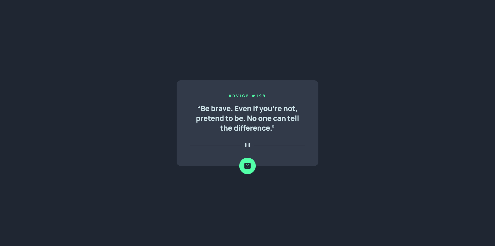

## Challenge
This component should:
- Generate a new piece of advice when the dice icon is clicked
- Show hover states for interactive elements
- Respond to the device's screen size

### Links

- Solution: 
- Live Site:

### Built with

- Semantic HTML5 markup
- CSS custom properties
- Desktop-first workflow
- ES6 JavaScript

## Author

- Frontend Mentor [Isaiah-B](https://www.frontendmentor.io/profile/Isaiah-B)